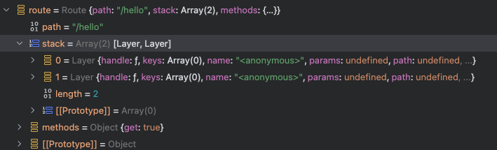

# express 미들웨어는 동기로 되어 있을까? 비동기로 되어 있을까?
기본적으로 express의 미들웨어는 stack로 구성되어 콜백 형식으로 함수들을 다음으로 전달한다.

예를 들어 아래와 같은 코드가 구성되어 있다고 가정하자.
```javascript
app.get('/hello', function (req, res, next) {
  console.log('test1')
  next()
}, function (req, res) {
  res.send('test')
})
```

`/hello`에 미들웨어 함수가 하나있고 그 후 다음 응답을 처리하는 함수가 존재한다.
이럴 경우 아래 이미지와 같이 /hello라는 경로의 stack 프로퍼티에 함수의 배열로 저장된다.



그 후 요청이 들어오게되면 route의 `handle`를 통해 요청에 일치하는 라우트를 찾게 된다.
아래 코드를 통해 stack를 돌면서 일치하는 route를 찾는다.

```javascript
// router/index.js
Router.prototype.handle = function handle (req, res, callback) {
  if (!callback) {
    throw new TypeError('argument callback is required')
  }

  (생략...)

  next()

  function next (err) {
    (생략...)

    // find next matching layer
    let layer
    let match
    let route

    while (match !== true && idx < stack.length) {
      layer = stack[idx++]
      match = matchLayer(layer, path)
      route = layer.route

      (생략...)
    }

    (생략...)

    // this should be done for the layer
    processParams(self.params, layer, paramcalled, req, res, function (err) {
      if (err) {
        next(layerError || err)
      } else if (route) {
        layer.handleRequest(req, res, next) // 이 함수를 통해 미들웨어가 실행됨
      } else {
        trimPrefix(layer, layerError, layerPath, path)
      }

      sync = 0
    })
  }
  (생략...)
}
```

라우트를 찾게 되면 아래 함수를 실행하게 되는데 해당 함수에서 동기 함수일 경우 동기적으로 처리하고
비동기 함수이면 `Promise` 를 통해 비동기 함수를 처리한 후 다음 callback(=next 함수)로 넘겨준다.

```javascript
// router/lib/layer.js


Layer.prototype.handleRequest = function handleRequest (req, res, next) {
  const fn = this.handle

  if (fn.length > 3) {
    // not a standard request handler
    return next()
  }

  try {
    // invoke function
    const ret = fn(req, res, next)

    // wait for returned promise
    if (isPromise(ret)) {
      ret.then(null, function (error) {
        next(error || new Error('Rejected promise'))
      })
    }
  } catch (err) {
    next(err)
  }
}
```

결론: express의 미들웨어는 요청 이벤트를 처리 하는 과정에서 `콜백`으로 처리 되는 것으로 보아 함수를 즉시 처리하는 미들웨어는 동기적이며 그렇지 않은 함수는 비동기적 미들웨어라 할 수 있을 것 같습니다. 따라서 혼합적으로 처리된다고 볼 수 있습니다.

> 참고: 미들웨어에서 `app.get('/', A, B, C)` 이렇게 처리하는 것 과 `app.get('/', [A,B],C)` 로 처리하는 것은 동일한 처리 순서를 가집니다.
